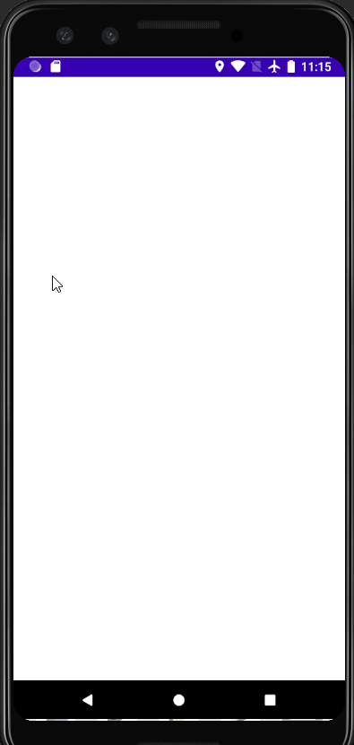

# Background Task Manager API for android

<!--- These are examples. See https://shields.io for others or to customize this set of shields. You might want to include dependencies, project status and licence info here --->


BackgroundTaskManager API provides the ability to chain multiple tasks into a singleton instance of backgroundTaskManager.It also includes the ability to process tasks SERIALLY ( tasks processed one after another) or in PARALLEL ( multiple tasks processed simultaneously).
This library handles thread processing as required and is optimised to handle tasks efficiently. Maximum PARALLEL tasks that can be executed simultaneously is computed and processed accordingly. 
If the TaskQueue exceeds the maximum available cores of a CPU, the all subsequent tasks are queued for execution. 
This also includes extended features invoking a callable function before or after completion of the tasks. This feature is wrapped in a familiar and easy method called before() and then().


## Prerequisites

Before you begin, ensure you have met the following requirements:
<!--- These are just example requirements. Add, duplicate or remove as required --->
* You have installed the latest version of Android Studio.
* uuhhmmmm...  nothing else.....

## Usage

```gradle

implementation 'com.github.JerrySJoseph:BackgroundTaskManager:v1.0.1-alpha'

```

Don't forget to add jitpack in your project level repositories

```gradle
allprojects {
    repositories {
        ...
        maven { url 'https://jitpack.io' }
    }
}
```
## Demo

### Parallel Processing



### Serial Processing


## Contributing to this project
<!--- If your README is long or you have some specific process or steps you want contributors to follow, consider creating a separate CONTRIBUTING.md file--->
To contribute to this project, follow these steps:

1. Fork this repository.
2. Create a branch: `git checkout -b <branch_name>`.
3. Make your changes and commit them: `git commit -m '<commit_message>'`
4. Push to the original branch: `git push origin <project_name>/<location>`
5. Create the pull request.

Alternatively see the GitHub documentation on [creating a pull request](https://help.github.com/en/github/collaborating-with-issues-and-pull-requests/creating-a-pull-request).

## Contributors

Thanks to the following people who have contributed to this project:

* [@jerrysjoseph](https://github.com/JerrySJoseph) 📖

You might want to consider using something like the [All Contributors](https://github.com/all-contributors/all-contributors) specification and its [emoji key](https://allcontributors.org/docs/en/emoji-key).

## Contact

If you want to contact me you can reach me at <your_email@address.com>.

## License
<!--- If you're not sure which open license to use see https://choosealicense.com/--->

This project uses the following license: [<license_name>](<link>).
